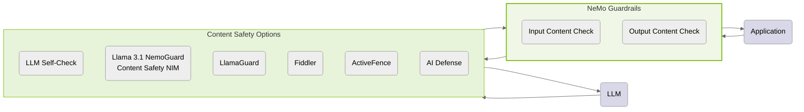
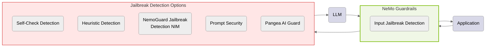
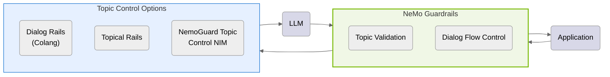
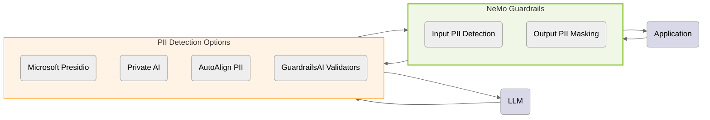
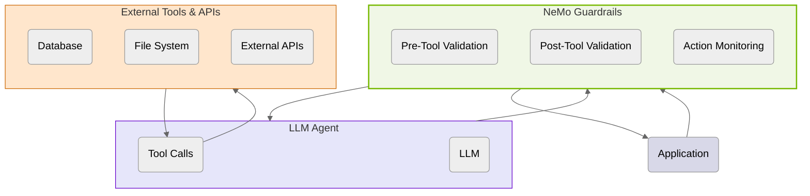
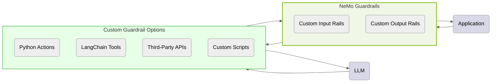
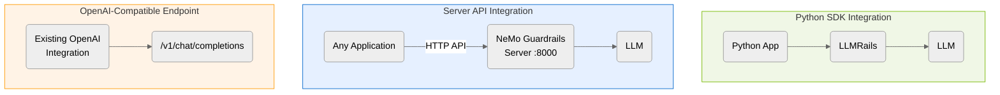
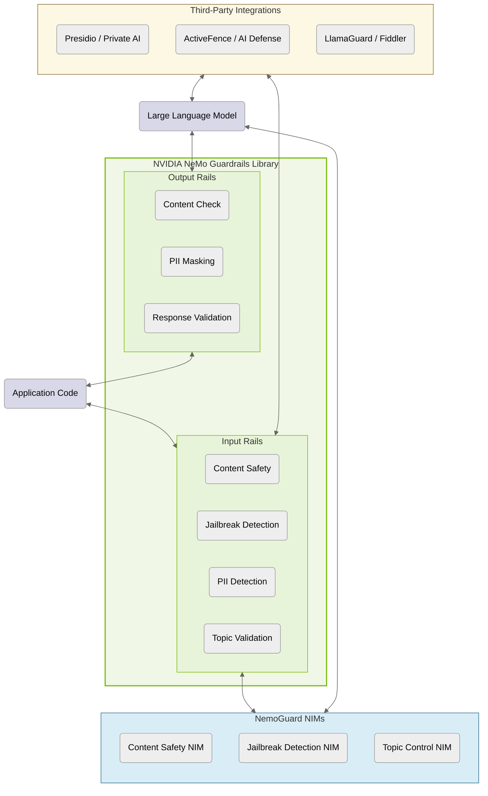

The following diagrams illustrate the NeMo Guardrails architecture for each use case.

---

## 1. Content Safety

*Content safety guardrails check both user inputs and LLM outputs for harmful content.*

---

## 2. Jailbreak Protection

*Jailbreak protection prevents adversarial attempts from bypassing safety measures.*

---

## 3. Topic Control

*Topic control ensures conversations stay within predefined subject boundaries.*

---

## 4. PII Detection and Masking

*PII detection protects user privacy by detecting and masking sensitive data.*

---

## 5. Agentic Security

*Agentic security provides guardrails for LLM agents using tools and external systems.*

---

## 6. Custom and Third-Party Guardrails

*Build custom guardrails using Python actions, LangChain tools, or third-party APIs.*

---

## 7. Integration Options

*Multiple integration options: Python SDK, HTTP Server API, or OpenAI-compatible endpoint.*

---

## Combined Architecture Overview

*Complete architecture showing all guardrail types and integration options.*
