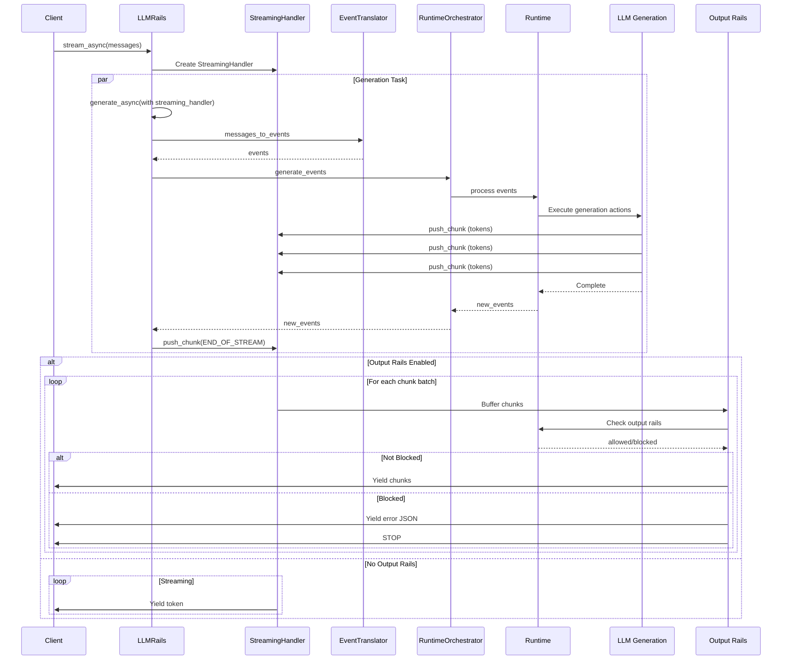

# NeMo-Guardrails LLMRails Refactor

## High-Level Request Flow

```mermaid
flowchart TD
    Start([Client Request]) --> Entry[LLMRails.generate_async]

    Entry --> Validate{Validate Input}
    Validate -->|prompt or messages?| Convert[Convert to Messages Format]

    Convert --> ProcessOptions[Process Generation Options]
    ProcessOptions --> InitContext[Initialize Context Variables]
    InitContext --> InjectOptions[Inject Options into Messages]

    InjectOptions --> EventTranslation[EventTranslator.messages_to_events]
    EventTranslation --> CheckCache{Check Event Cache<br/>Colang 1.0 only}
    CheckCache -->|Cache Hit| UseCached[Use Cached Events]
    CheckCache -->|Cache Miss| Transform[Transform Messages to Events]
    UseCached --> Events[Event List]
    Transform --> Events

    Events --> RuntimeOrch[RuntimeOrchestrator.generate_events]

    RuntimeOrch --> VersionCheck{Colang Version?}

    VersionCheck -->|1.0| Runtime1[RuntimeV1_0.generate_events]
    VersionCheck -->|2.x| Runtime2[RuntimeV2_x.process_events]

    Runtime1 --> ExecuteFlows1[Execute Colang 1.0 Flows]
    Runtime2 --> ExecuteFlows2[Execute Colang 2.x Flows]

    ExecuteFlows1 --> Rails
    ExecuteFlows2 --> Rails

    subgraph Rails["Rails Processing"]
        InputRails[Input Rails] --> DialogRails[Dialog Rails]
        DialogRails --> RetrievalRails[Retrieval Rails]
        RetrievalRails --> GenerationRails[Generation Rails]
        GenerationRails --> OutputRails[Output Rails]
    end

    Rails --> Actions[Execute Actions]

    subgraph Actions["Action Execution"]
        SelfCheck[self_check_input/output]
        LLMGeneration[LLM Generation Actions]
        KBRetrieval[KB Retrieval Actions]
        CustomActions[Custom Registered Actions]
    end

    Actions --> NewEvents[New Events Generated]
    NewEvents --> CacheUpdate{Update Cache?<br/>Colang 1.0 only}
    CacheUpdate -->|Yes| UpdateCache[Update Event Cache]
    CacheUpdate -->|No| AssembleResponse
    UpdateCache --> AssembleResponse

    AssembleResponse[ResponseAssembler.assemble_response]
    AssembleResponse --> ExtractData[Extract Responses & Metadata]
    ExtractData --> BuildMessage[Build Response Message]
    BuildMessage --> AddMetadata[Add Tool Calls, Reasoning, etc.]

    AddMetadata --> CreateLog{Include Log?}
    CreateLog -->|Yes| ComputeLog[Compute Generation Log]
    CreateLog -->|No| FinalResponse
    ComputeLog --> FinalResponse[GenerationResponse Object]

    FinalResponse --> Tracing{Tracing Enabled?}
    Tracing -->|Yes| ExportTraces[Export Traces]
    Tracing -->|No| Return
    ExportTraces --> Return

    Return([Return Response to Client])

    style Start fill:#e1f5e1
    style Return fill:#e1f5e1
    style Rails fill:#fff4e6
    style Actions fill:#e6f3ff
```

## Streaming Request Flow

## Key Components Description

### LLMRails
- **Purpose**: Main entry point for the guardrails system
- **Key Methods**:
  - `generate_async()`: Main generation method
  - `stream_async()`: Streaming generation
  - `register_action()`: Register custom actions
- **Responsibilities**: Coordinates all components and manages the request lifecycle

### EventTranslator
- **Purpose**: Convert between message format and internal event format
- **Features**:
  - Caches message-to-event mappings (Colang 1.0)
  - Handles both Colang 1.0 and 2.x formats
  - Supports context injection

### RuntimeOrchestrator
- **Purpose**: Manages the Colang runtime execution
- **Features**:
  - Version-aware (Colang 1.0 vs 2.x)
  - Process events through flows
  - Coordinate action execution

### RuntimeV1_0 / RuntimeV2_x
- **Purpose**: Execute Colang flows and manage state
- **Features**:
  - Flow execution engine
  - Action dispatcher
  - State management
  - Event processing

### LLM Generation Actions
- **Purpose**: Handle LLM calls for various tasks
- **Key Actions**:
  - `generate_user_intent`: Canonical form generation
  - `generate_next_step`: Next step prediction
  - `generate_bot_message`: Response generation
  - `retrieve_relevant_chunks`: KB retrieval

### ResponseAssembler
- **Purpose**: Build final response from events
- **Features**:
  - Extract bot messages
  - Handle tool calls
  - Include reasoning content
  - Generate logs
  - Compute state for next request

### ModelFactory
- **Purpose**: Manage LLM instances
- **Features**:
  - Main LLM initialization
  - Specialized LLMs (embeddings, fact-checking, etc.)
  - Model configuration
  - Streaming support detection

### KnowledgeBaseBuilder
- **Purpose**: Build and manage knowledge base
- **Features**:
  - Vector store creation
  - Document indexing
  - Embedding generation
  - Retrieval support
